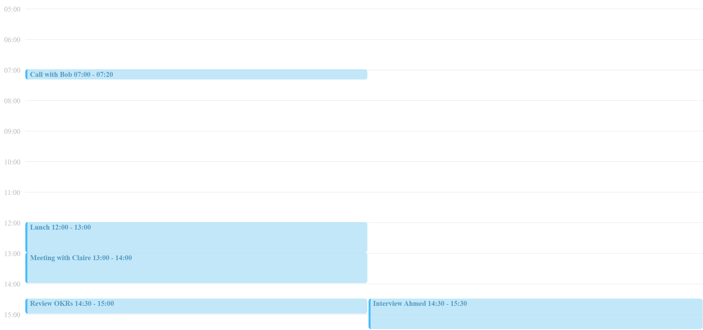

## What choices did you make and why?
- I decided to start the timeline with 0 because the design looked inspired by Google Calendar and that is how they do it
- I made each hour 60 pixels so that 1 min = 1px in terms of size.
- I added a condition that if a meeting is less than 15 minutes long I make it look 15 minutes long because of the text size
- Added the time on the side instead of on top. Makes calculating small meeting a little easier, and it is how Google Calendar
does it and as mentioned the task was quite similar to that.
## What challenges did you face?
- Making the lines was trickier than I thought, I had to use 2 grids to make them overlap correctly. I had to add a padding, 
which was not that great for matching the line to be in the middle of the time markers.
## What tradeoffs did you choose?
- I made the components into DailyCalendar and Event, technically the DailyCalendar is just a grid with multiple events, 
however I decided DailyCalendar is more suitable name since a few can be put next to each other to form a weekly one
- I thought of adding SCSS as a preprocessor for variables like 60px, but with the time constraint I figured it is okay to repeat it 3 times
## What do you like and not like about your solution?
- It is only a view with no actions being taken, so I find it a bit lackluster.
- I haven't added tests yet, and I am out of time.
## What areas would you work on next?
- Adding Tests for sure. Maybe using enzymeIds and checking how many columns there are
- Adding actions such as adding meetings, expanding on the graphql api.
- With current design a Weekly Calendar would not be difficult to add
- Make it more robust with scss variables and not hardcoding so much in terms of padding, borders, sizes, pixels which will make it more mobile friendly

## Final Version Screenshot 
(P.S. My screen is 32 inches so the preview doesn't look so nice when small)

